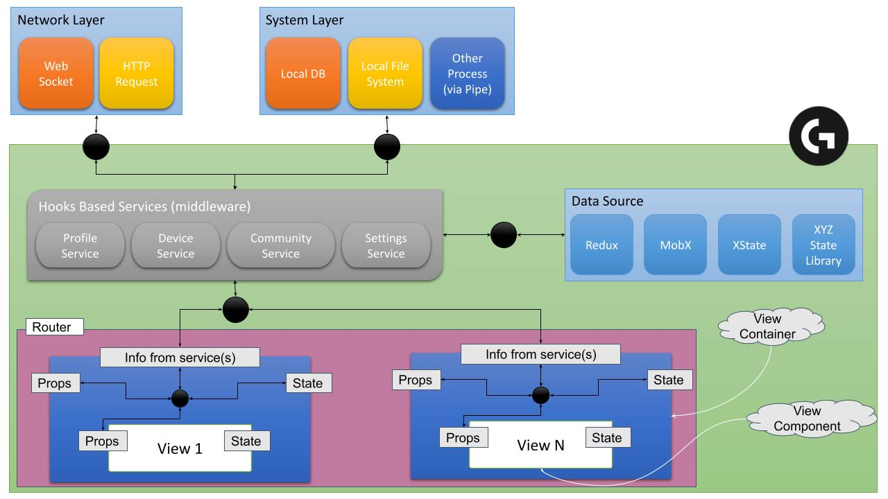

# Dev Doc

**scripts:**
- `yarn start:redux` to start the app with **redux** as state management library
- `yarn start:mobx` to start the app with **mobx** as state management library
- `yarn build:redux` to build the app with **redux** as state management library
- `yarn build:mobx` to build the app with **mobx** as state management library

# Recommended UI architecture

Last Update: `2021-Aug-12`

## Problem Statement:

### Statement #1:

> UI layers (components) are tightly coupled with ‘some’ state management library (right now we are using redux). Which leads to the following problems,

1. It makes it difficult to change from one state management to another.
1. Makes unit testing the views hard without mocking those stores
1. Makes it difficult to reuse the component in different place / project
1. No clear “Separation of Concern”

### Statement #2:

> Global states are polluted with lots of local states. Which leads to the following problems,

1. Too many boilerplate codes.
1. Huge performance hit. When one teeny-tiny component updates the global state (which is supposed to be maintained in the local state),
   - it forces the entire app to re-render
   - It executes all the reducers (which is an unnecessary workload)
   - Needs extra effort to make the app maintain its performance, which leads to bigger bundle size.
1. Global state becomes unmanageable
1. Global state becomes unclear & error prone
1. Debugging becomes more complex
1. Creates negative impact on productivity.
1. When some of those small components get replaced by new components due to design changes, it will be easy for developers to forget to remove(or for fear of introducing blocker issue) all the “state management related” and its “boilerplate” codes, it leaves a lot of “dead codes” and “dead states” in the global state.
1. It leads to all the problems mentioned in problem statement #1 as well.

## Proposed Solution:

1. Need to separate (De-Couple) the views from the state management library by,
   - Using “Service” as a middle man between a View-Container and a global store.
   - Using a “view-container” component as wrapper on top of each view/route component to process global state and manage local state and pass them to childs via props.
1. Handle the “local” state within the component itself.
1. If siblings need to share the same data(state), hoist (move) them above to the parent “Container” component and receive / share them via props.
1. Introduce “Typescript” gradually for strict type checking to avoid run-time error.
1. Add more “unit test” to the “View” component

## High level UI Architecture Diagram

## Other Open Items to consider:

1. Introduce SCSS for css pre-processing
1. Co-locate the CSS / SCSS files along with its relevant View files
1. Co-locate unit test scripts along with the View files
1. Lazy-Load modules on demand

## Tech Stack:

1. React
1. Redux / React-Redux / mobx / xstate
1. React-Router-Dom
1. Typescript
1. Sass
